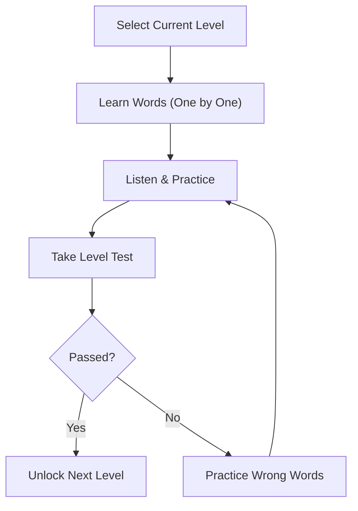

# BeeSpell Dictionary - Project Plan

## Overview
**Project name:** BeeSpell Dictionary
**Technology:** React/Next.js + TypeScript + JSON + localStorage
**Login:** No
**Database/API:** No (Static Data + LocalStorage)
**Goal:** A simple linear Spelling Bee learning website where students learn words step-by-step from Beginner to Advanced, starting strictly from Level 0 (alphabets/sounds).

## Main Learning Flow




## Level Structure (50 Levels, 10 Tiers)
| Level | Name                    | Total Words        | Learning target                          | Unlock Requirement           | Badge / Rank Icon | Pass Score | XP Reward |
| ----: | ------------------------ | ------------------: | ----------------------------------------- | ------------------------------ | ------------------- | ---------: | --------: |
|     0 | Foundation               |                  50 | Alphabet, sounds ও পরিচিত শব্দ            | Always unlocked                | 🥚 Egg               |        70% |        50 |
|     1 | Starter                  |                  75 | সহজ 2–4 letter words                      | Pass Level 0                   | 🐣 Hatchling         |        70% |        75 |
|     2 | Beginner                 |                 100 | Common daily words                        | Pass Level 1                   | 🐤 Chick             |        70% |       100 |
|     3 | Learner                  |                 125 | Basic sentence-context words              | Pass Level 2                   | 🐥 Fledgling         |        70% |       125 |
|     4 | Explorer                 |                 150 | Everyday object & action words            | Pass Level 3                   | 🦋 Wings             |        70% |       150 |
|     5 | Elementary               |                 175 | Syllable ও spelling pattern               | Pass Level 4                   | 🌱 Sprout            |        72% |       175 |
|     6 | Builder                  |                 200 | Word-family & rhyming patterns            | Pass Level 5                   | 🧱 Builder           |        72% |       200 |
|     7 | Practicer                |                 250 | Repetition-based spelling drills          | Pass Level 6                   | 🎯 Practicer         |        72% |       225 |
|     8 | Improver                 |                 300 | Commonly confused word pairs              | Pass Level 7                   | 📈 Improver          |        72% |       250 |
|     9 | Achiever                 |                 350 | Short compound words                      | Pass Level 8                   | 🏅 Achiever          |        72% |       275 |
|    10 | Intermediate             |                 400 | Prefix, suffix ও silent letters           | Pass Level 9                   | 📘 Intermediate      |        75% |       300 |
|    11 | Reader                   |                 450 | Reading-level vocabulary                  | Pass Level 10                  | 📖 Reader            |        75% |       325 |
|    12 | Thinker                  |                 500 | Homophones ও tricky sounds                | Pass Level 11                  | 🧠 Thinker           |        75% |       350 |
|    13 | Scholar                  |                 600 | Subject-based vocabulary (school/science) | Pass Level 12                  | 🎓 Scholar           |        75% |       375 |
|    14 | Wordsmith                |                 700 | Descriptive ও adjective-heavy words       | Pass Level 13                  | ✍️ Wordsmith         |        75% |       400 |
|    15 | Upper Intermediate       |                 800 | Complex spelling rules                    | Pass Level 14                  | 📚 Upper Int.        |        77% |       425 |
|    16 | Specialist               |                 900 | Subject-specific technical words          | Pass Level 15                  | 🔬 Specialist        |        77% |       450 |
|    17 | Analyst                  |                1000 | Multi-syllable analytical words           | Pass Level 16                  | 🧩 Analyst           |        77% |       475 |
|    18 | Strategist               |                1100 | Words with irregular spelling             | Pass Level 17                  | ♟️ Strategist         |        77% |       500 |
|    19 | Tactician                |                1200 | Root-word & etymology basics              | Pass Level 18                  | 🗡️ Tactician          |        77% |       525 |
|    20 | Advanced                 |                1300 | Difficult ও academic words                | Pass Level 19                  | 🚀 Advanced          |        80% |       550 |
|    21 | Expert                   |                1400 | Competition-level baseline words          | Pass Level 20                  | ⭐ Expert            |        80% |       575 |
|    22 | Virtuoso                 |                1500 | Advanced academic vocabulary              | Pass Level 21                  | 🎻 Virtuoso          |        80% |       600 |
|    23 | Maestro                  |                1700 | Latin/Greek-origin words                  | Pass Level 22                  | 🎼 Maestro           |        80% |       625 |
|    24 | Prodigy                  |                1900 | Cross-topic challenge words               | Pass Level 23                  | ✨ Prodigy           |        80% |       650 |
|    25 | Champion                 |                2100 | Rare ও international words                | Pass Level 24                  | 🏆 Champion          |        82% |       675 |
|    26 | Challenger               |                2300 | Foreign-loanword spellings                | Pass Level 25                  | 🥊 Challenger        |        82% |       700 |
|    27 | Contender                |                2500 | High-frequency competition words          | Pass Level 26                  | 🎖 Contender          |        82% |       725 |
|    28 | Gladiator                |                2700 | Words with silent/double letters          | Pass Level 27                  | ⚔️ Gladiator          |        82% |       750 |
|    29 | Warrior                  |                3000 | Speed-spelling under pressure             | Pass Level 28                  | 🛡️ Warrior            |        82% |       775 |
|    30 | Grandmaster              |                3300 | Obscure & language-origin words           | Pass Level 29                  | 👑 Grandmaster       |        85% |       800 |
|    31 | Sage                     |                3600 | Archaic & literary words                  | Pass Level 30                  | 🧙 Sage              |        85% |       825 |
|    32 | Mentor                   |                4000 | Scientific & medical basics               | Pass Level 31                  | 🧑‍🏫 Mentor           |        85% |       850 |
|    33 | Luminary                 |                4400 | Advanced etymology patterns               | Pass Level 32                  | 💡 Luminary          |        85% |       875 |
|    34 | Vanguard                 |                4800 | Rare compound & hyphenated words          | Pass Level 33                  | 🚩 Vanguard          |        85% |       900 |
|    35 | Elite                    |                5200 | Regional Spelling Bee preparation         | Pass Level 34                  | 💎 Elite             |        87% |       925 |
|    36 | Titan                    |                5600 | State-level vocabulary                    | Pass Level 35                  | 🗿 Titan             |        87% |       950 |
|    37 | Phenom                   |                6000 | Cross-language origin words               | Pass Level 36                  | 🌟 Phenom            |        87% |       975 |
|    38 | Dynamo                   |                6500 | High-difficulty homophone sets            | Pass Level 37                  | ⚡ Dynamo            |        87% |      1000 |
|    39 | Trailblazer              |                7000 | Championship-tier word lists              | Pass Level 38                  | 🔥 Trailblazer       |        87% |      1025 |
|    40 | Regional Contender       |                7500 | Regional Spelling Bee preparation         | Pass Level 39 + Review Streak  | 🎗 Regional          |        90% |      1050 |
|    41 | State Qualifier          |                8000 | State-level Spelling Bee vocabulary       | Pass Level 40 + Review Streak  | 🥉 State Qualifier   |        90% |      1075 |
|    42 | State Finalist           |                8500 | State-level advanced vocabulary           | Pass Level 41 + Review Streak  | 🏵 State Finalist    |        90% |      1100 |
|    43 | National Contender       |                9000 | National Spelling Bee preliminary         | Pass Level 42 + Review Streak  | 🥈 National Contender|        90% |      1125 |
|    44 | National Challenger      |                9500 | National Spelling Bee preliminary (adv.)  | Pass Level 43 + Review Streak  | 🎯 National Challenger|       90% |      1150 |
|    45 | National Finalist        |               10000 | National Spelling Bee advanced            | Pass Level 44 + Review Streak  | 🥇 National Finalist |        92% |      1175 |
|    46 | International Contender  |               10500 | Multidialectal & regional-variant words   | Pass Level 45 + Review Streak  | 🌍 Intl. Contender   |        92% |      1200 |
|    47 | International Master     |               11000 | Highly complex multidialectal words       | Pass Level 46 + Review Streak  | 🌐 Intl. Master      |        92% |      1225 |
|    48 | World Champion           |               12000 | World-class competition vocabulary        | Pass Level 47 + Review Streak  | 🏵 World Champion    |        92% |      1250 |
|    49 | Ultimate Legend          |              13000+ | Medical, scientific & rarest words        | Pass Level 48 + Review Streak  | 👑 Legend Crown      |        95% |      1500 |

### Tier Grouping (10 Tiers × 5 Levels)
| Tier | Levels | Tier Name          |
| ---: | ------ | ------------------ |
|    1 | 0–4    | Hatchling Tier      |
|    2 | 5–9    | Sprout Tier         |
|    3 | 10–14  | Scholar Tier        |
|    4 | 15–19  | Specialist Tier     |
|    5 | 20–24  | Expert Tier         |
|    6 | 25–29  | Champion Tier       |
|    7 | 30–34  | Master Tier         |
|    8 | 35–39  | Elite Tier          |
|    9 | 40–44  | National Tier       |
|   10 | 45–49  | Legend Tier         |

### Level Progression Rules
- There is a single, global level track — no categories. Every learner follows the same Level 0 → Level 49 path in order.
- A level must be passed to unlock the next one; levels cannot be skipped.
- Pass score threshold rises with difficulty (70% early levels → 95% at Ultimate Legend) to keep advanced ranks meaningful.
- XP accumulates across all completed levels and drives the user's overall Rank shown on `/progress`.
- Badge/Rank icon for a level is awarded once, on first pass, and displayed on the `/levels` Journey Map and `/progress` profile.
- Levels 40–49 ("National Tier" + "Legend Tier") additionally require a **Review Streak**: no more than 2 wrong words in the prior level's test, encouraging mastery before advancing into Spelling-Bee-competition-grade content.

## User Journey (Step-by-Step)

### 1. Levels Journey Map
The `/levels` page lists all 50 levels in order (Level 0 Foundation → Level 49 Ultimate Legend), grouped by tier — see [Level Structure (50 Levels, 10 Tiers)](#level-structure-50-levels-10-tiers) for the full name/badge list. Each level node displays:
- Level number & name
- Badge/Rank icon
- Total words
- Completed words
- Progress percentage
- 🔒 Lock icon and required unlock condition, if locked

*Initially, only Foundation (Level 0) is unlocked. Passing a level unlocks the next one. Levels 40–49 also require a Review Streak (see Level Progression Rules).*

### 2. Learning Each Word
One word displayed per card:
```text
Word: Elephant
Pronunciation: /ˈel.ɪ.fənt/
Bangla Pronunciation: এলিফ্যান্ট
Meaning: A very large animal
Bangla Meaning: হাতি
Syllables: el • e • phant
Example: The elephant is a large animal.
Hint: Starts with “ele” and ends with “phant”
```

Actions for each word:
- 🔊 Listen
- 🐢 Listen Slowly
- 👁 Show/Hide Word
- 💡 Show Hint
- ✅ I Learned This
- ➡️ Next Word

## Learning Steps (Per Level)
A level does not end with a test directly. It follows these stages:

**Stage 1: Learn** - View word, read meaning, listen to pronunciation.
**Stage 2: Listen** - Word is hidden. Identify the word by listening to audio.
**Stage 3: Build** - Rearrange scrambled letters (e.g., `t – a – c → cat`).
**Stage 4: Complete** - Fill in missing letters (e.g., `e l _ p h a n t`).
**Stage 5: Spell** - Listen to audio and type the complete spelling.
**Stage 6: Review** - Practice the misspelled words again.
**Stage 7: Level Test**
- 10–20 questions
- Activities: Listen and type, missing letters, arrange letters, multiple choice.
- Passing score: 80%

**Stage 8: Complete**
If Passed:
- Level completed message
- Score
- Accuracy
- Wrong words
- Next level unlocked
- Practice again option

## Learning Progress (LocalStorage)
Data is saved in the browser's `localStorage` (No login required):
- Completed levels
- Learned words
- Wrong words
- Total XP & Rank
- Current learning position
- Unlocked levels
*> Note: Clearing browser data will reset progress.*

## JSON Data Structure
```json
[
  {
    "id": "lvl0-001",
    "level": 0,
    "order": 1,
    "word": "a",
    "pronunciation": "/eɪ/",
    "banglaPronunciation": "এ",
    "meaning": "The first letter of the alphabet",
    "banglaMeaning": "ইংরেজি বর্ণমালার প্রথম অক্ষর",
    "syllables": ["a"],
    "example": "A is for Apple.",
    "hint": "The very first letter.",
    "image": "/images/level0/a.webp"
  }
]
```

## Recommended Pages
- `/` - Home
- `/levels` - The Journey Map (all levels)
- `/learn/0` - Step-by-step learning for Level 0
- `/practice/0` - Practice activities
- `/test/0` - Level test
- `/progress` - Local learning progress

## Simple Menu
- Home
- Levels Journey
- Continue Learning
- Difficult Words
- Progress
- About

## Home Page Sections
- Hero: “Learn Spelling from Zero to Champion”
- Continue Learning button
- View Levels Journey
- How It Works
- Daily Word
- Overall Progress

## Completion Rules
- Must click `I Learned This` on every word.
- Must complete all words in a level to unlock the test.
- Pass score is dynamic (70% - 92%).
- If failed, a revision session starts with wrong words only.
- Can re-take the test after revision.
- Passing unlocks the next level.

## Implementation Task List
- [x] Create project documentation (`docs/project_plan.md`).
- [x] Initialize Next.js project with App Router and TypeScript.
- [x] Configure global CSS (Premium Glassmorphism, colors, fonts).
- [x] Build root layout and Navbar.
- [x] Create styled Landing Page (Hero section, Feature cards).
- [ ] Define TypeScript interfaces for JSON data models (Level, Word).
- [ ] Create mock JSON data file for `words` (Level 0 starting from Alphabets).
- [ ] Build the `/levels` Journey Map page.
- [ ] Implement `localStorage` state management hook for tracking user progress, XP, and unlocks.
- [ ] Build the Learning Session Interface (`/learn/[level]`):
  - [ ] Stage 1: Learn (Word display, meaning, pronunciation audio).
  - [ ] Stage 2: Listen (Identify word from audio).
  - [ ] Stage 3: Build (Scrambled letters).
  - [ ] Stage 4: Complete (Fill in missing letters).
  - [ ] Stage 5: Spell (Type full word from audio).
  - [ ] Stage 6: Review (Practice wrong words).
- [ ] Build the Level Test Interface (`/test/[level]`) with scoring system.
- [ ] Build the Level Complete Result Screen (Score, XP, Badge earned, Unlock next level).
- [ ] Build the `/progress` Dashboard (User Rank, total XP, unlocked badges, mastered words).
- [ ] Integrate text-to-speech (TTS) for word pronunciation using Web Speech API.
- [ ] Final polish: animations, responsive design tweaks, and performance checks.
